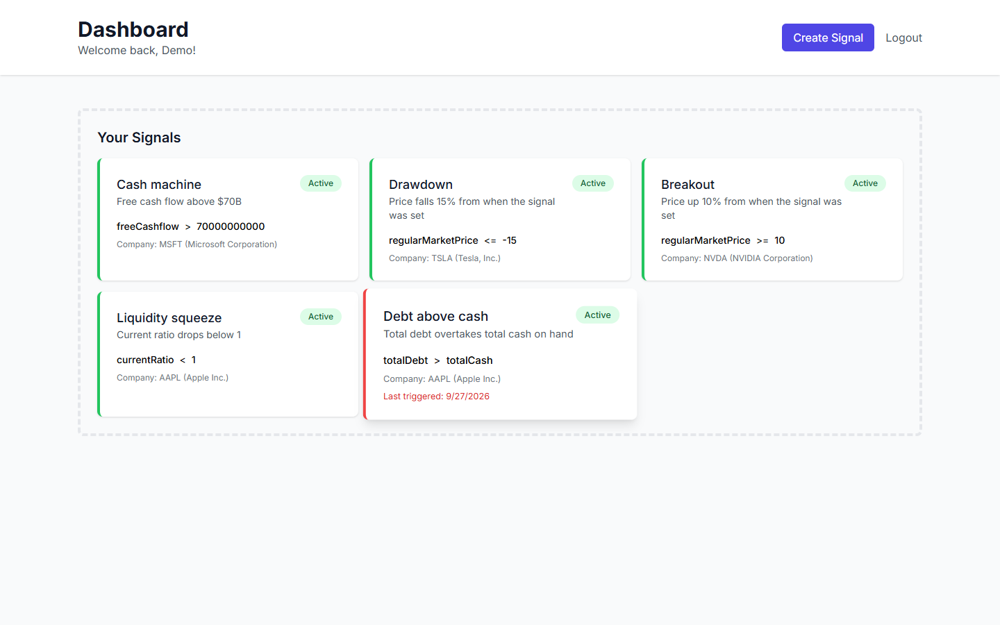
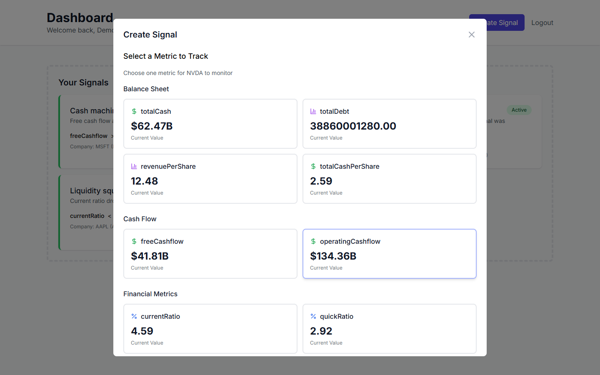
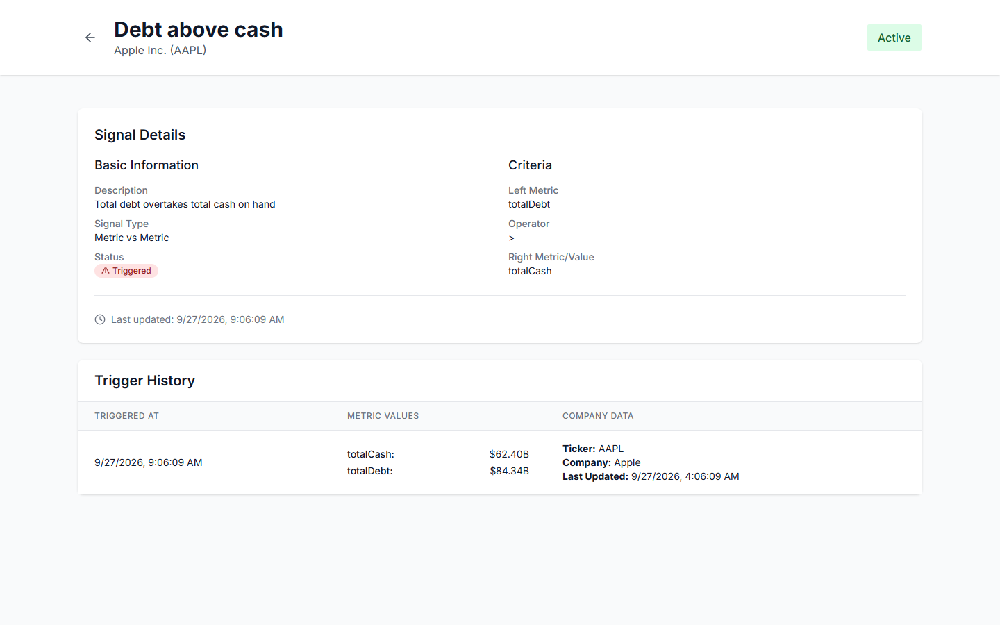
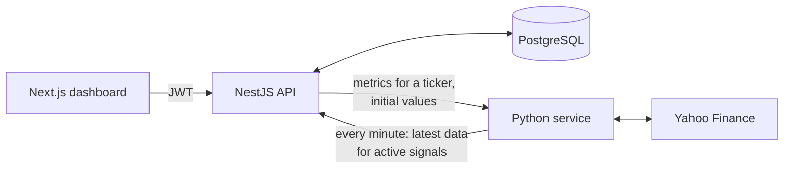

# MarginCall

Alerts on company fundamentals and market data. Pick a stock, choose a metric, set a rule, and MarginCall checks it against live Yahoo Finance data every minute and records every time it fires.



## What it does

- **Three kinds of signal.**
  - **Metric vs metric:** "Apple's total debt is above its total cash".
  - **Metric vs value:** "current ratio below 1".
  - **Metric vs % change:** "Tesla falls 15% from the price when I set this".
- **Five operators:** `>`, `<`, `=`, `>=`, `<=`.
- **27 metrics** across the balance sheet, cash flow, financial ratios, the income statement and market data, each shown with its live value while you build the signal.
- **Every-minute monitoring.** Each active signal is re-evaluated against fresh data, and every trigger is stored with the exact values that caused it.
- **Accounts.** Sign-up and login with JWT, and each user sees and manages only their own signals, with a switch to pause or resume any one.

| Build a signal from live data | Trigger history |
|---|---|
|  |  |

## How it works



1. **Build.** The dashboard asks the API which metrics exist for a ticker, and the Python service looks them up on Yahoo Finance with their current values. The user picks a metric, an operator, and a second metric, a fixed value or a percentage.
2. **Save.** The API stores the signal with the starting values of its metrics, so percentage rules have a baseline.
3. **Watch.** Every minute, the Python service finds the signals due for an update, fetches their metrics, and posts the data to the API.
4. **Evaluate.** The API compares the values according to the signal type and operator. When a rule holds, it marks the signal triggered and writes a history record with the values and a timestamp.

## API

| Method | Path | |
|---|---|---|
| `POST` | `/auth/register`, `/auth/login` | Create an account or sign in; returns a JWT |
| `POST` | `/signals` | Create a signal |
| `GET` | `/signals/my` | The signed-in user's signals |
| `PUT` | `/signals/:id/toggle` | Pause or resume a signal |
| `GET` | `/signals/:id/history` | Every trigger, with the values at the time |
| `GET` | `/signals/available-metrics/:ticker` | Metrics for a ticker, grouped, with live values |
| `GET` | `/signals/operators`, `/signals/types` | Supported operators and signal types |
| `POST` | `/signals/:id/update`, `/signals/:id/trigger` | Used by the Python service to deliver fresh data |

The Python service exposes `/health`, `/available-fields/:ticker` and `/fetch-initial-values`.

## Run it

```bash
docker compose up -d --build              # PostgreSQL, NestJS API (:3000), Python service (:5001)

cd frontend && npm install
NEXT_PUBLIC_API_URL=http://localhost:3000 npx next dev -p 3001   # dashboard on :3001
```

## Tech

- **Frontend:** Next.js 14, TypeScript, Tailwind CSS, Axios
- **API:** NestJS, TypeORM, PostgreSQL 15, Passport JWT, bcrypt
- **Data service:** Python, Flask, yahooquery, schedule
- **Infrastructure:** Docker Compose
